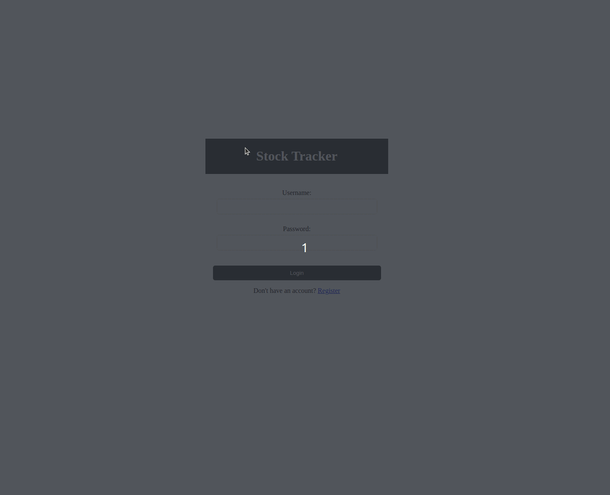
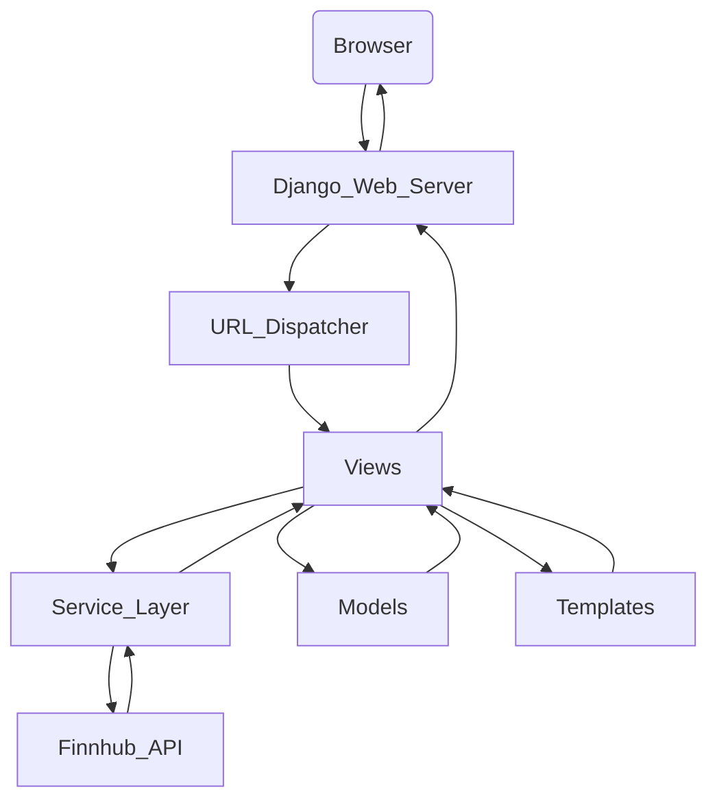

# Stock Tracker

    
    
    <a href="https://www.python.org/">
        
            
    </a>

Stock Tracker is a web application built with Django and Python. It allows users to track the price of stocks in real-time. The application uses the Finnhub API to fetch the latest stock prices.

## Features

- **User Registration and Authentication**
    - Users can register and login to the application. 

- **Stock Tracking**
    - Users can add stocks to their portfolio and track their prices in real-time

- **Stock Deletion** 
    - Users can remove stocks from their portfolio.

## Project Structure

The project is structured as a standard Django project with a single application `finnhub_app`. Here is a brief overview of the important files and directories in the project:

- `finnhub_app/`: This directory contains the Django application.

    - `admin.py`: This file is used to define the admin interface.

    - `apps.py`: This file is used to configure the Django application.

    - `forms.py`: This file contains the form for user registration.

    - `models.py`: This file defines the database models for the application.

    - `services.py`: This file contains the service layer functions, including `get_stock_data`, which encapsulates the logic for calling the Finnhub API.

    - `tests.py`: This file is used to write tests for the application.

    - `urls.py`: This file defines the URL routes for the application.

    - `views.py`: This file contains the view functions for the application.

    - `templates/`: This directory contains the HTML templates for the application.

- `finnhub_project/`: This directory contains the Django project settings.

    - `settings.py`: This file contains the settings for the Django project.

    - `urls.py`: This file defines the URL routes for the project.

    - `wsgi.py` and `asgi.py`: These files are used for deploying the application.

    - `manage.py`: This is a command-line utility that lets you interact with the Django project.

## Application Architecture

**User Registration and Authentication**:
    The user interacts with the registration or login page. The UI sends a request to the Django application, which validates the user's credentials and logs them in. The application uses Django's built-in authentication system. When a user registers or logs in, the user's information is stored in the Django's built-in User model. The registration and login forms are handled in `forms.py`, and the views for these forms are in `views.py`.

**Stock Tracking**:
    The user adds a stock to their portfolio through the UI. The UI sends a request to the Django application, which validates the stock symbol and adds the stock to the database. When a user wants to track a stock, they enter the stock symbol in the form on the `stocks.html` page. This triggers a POST request to the `fetch_stock_data` view in `views.py`.

**Fetching Stock Data**:
    The `fetch_stock_data` view uses the `get_stock_data` function from the service layer to get the latest stock prices from the Finnhub API. This function includes security checks such as input validation and exception handling to ensure the application is robust and secure. The API key for Finnhub is stored in the `.env` file and loaded into the settings using the `dotenv` package. The Finnhub API returns the current price of the stock.

**Storing Stock Data**:
    The application retrieves the stock data from the database and sends it to the UI, which displays the stocks to the user. The application stores the stock data in the `Stock` model defined in `models.py`. Each `Stock` instance has a symbol, price, and a timestamp of the last update. If the stock symbol already exists in the database, the application updates the price and the timestamp.

**User's Portfolio**:
    The user can remove a stock from their portfolio. This is handled by the `delete_stock` view in `views.py`, which removes the `PortfolioStock` instance linking the user's portfolio and the stock. Each user has a portfolio, which is a collection of stocks that the user is tracking. The portfolio is represented by the `Portfolio` model in `models.py`, which has a many-to-many relationship with the `Stock` model through the `PortfolioStock` model. When a user adds a stock to their portfolio, a new `PortfolioStock` instance is created linking the user's portfolio and the stock.

**Displaying Stock Data**:
    The `stocks.html` page displays the stocks in the user's portfolio. The page uses JavaScript to periodically get the latest stock data from the `stock_data_api` view in `views.py` and update the displayed prices.

**Deleting Stocks**:
    A user can remove a stock from their portfolio. This is handled by the `delete_stock` view in `views.py`, which removes the `PortfolioStock` instance linking the user's portfolio and the stock.

**Logout**:
    A user can log out of the application. This is handled by Django's built-in `LogoutView`.

The application's frontend is built with HTML and CSS, and it uses JavaScript for dynamic behavior. The HTML templates for the pages are stored in the `templates` directory in `finnhub_app`. The `home.html` template contains the common structure for all pages, and the other templates extend this base template. The JavaScript code in the `stocks.html` template fetches the latest stock data and updates the displayed prices.

### Security Measures

**Rate Limiting**: To protect against brute-force attacks and abuse, rate limiting has been implemented using the `ratelimit` decorator. This limits the number of requests a user can make to certain views within a specified timeframe. For example, users are limited to 5 requests per minute for the `home` and `register` views, and 60 requests per minute for the `fetch_stock_data` and `stock_data_api` views. This helps in mitigating potential denial-of-service (DoS) attacks and ensures fair usage of the application.

**HTTPS and HSTS**: The application is configured to use HTTPS for secure communication and to enforce HTTP Strict Transport Security (HSTS) headers. This ensures that all connections to the application are made over HTTPS, protecting against man-in-the-middle attacks and cookie hijacking. The `SECURE_SSL_REDIRECT` setting is used to redirect all non-HTTPS requests to HTTPS, further enhancing security.

**Content Security Policy (CSP)**: A Content Security Policy (CSP) has been implemented to help prevent Cross-Site Scripting (XSS) attacks. The policy specifies that only resources from the current origin should be considered valid sources of executable scripts, significantly reducing the risk of XSS attacks.

**Secure Cookies**: The application is configured to send the session and CSRF cookies only over HTTPS connections. This ensures that these cookies are not exposed over unencrypted connections, protecting against session hijacking and CSRF attacks.

**Password Hashing Algorithms**: Django's `PASSWORD_HASHERS` setting is configured to use multiple password hashing algorithms, including Argon2, PBKDF2, PBKDF2SHA1, BCryptSHA256, and BCrypt. These algorithms are designed to be resistant to various attacks and provide a high degree of security for stored passwords.

**Environment Variables**: Sensitive data such as database credentials and API keys are stored as environment variables and not included directly in the code or version control system. This practice helps to keep this sensitive data secure and separate from the application's codebase.

**Password Validators**: Django's `AUTH_PASSWORD_VALIDATORS` setting is used to check the strength of users' passwords when they are set. This includes checks for minimum length, common passwords, numeric passwords, and similarity to other attributes. These checks help ensure that users choose strong, secure passwords.

**Clickjacking Protection**: While the current views in the Stock Tracker application do not return HTML responses, it's important to consider the protection against Clickjacking for future development. Clickjacking is a malicious technique that tricks users into clicking on hidden elements on a webpage, potentially leading to unintended actions. To mitigate this risk, the `X-Frame-Options` middleware is included in the Django project. This middleware sets the `X-Frame-Options` header to `DENY` for all responses that do not already have it, effectively preventing the application from being embedded within an iframe. This measure is crucial for any view that might return HTML content in the future, ensuring that the application remains secure against Clickjacking attacks.

#### Note for Production Environment

Before deploying the application to a production environment, ensure the following settings in `settings.py` are adjusted for security and performance:

- `SECURE_HSTS_INCLUDE_SUBDOMAINS` can be set to `True` to include all subdomains in the HSTS policy.
- `SECURE_HSTS_PRELOAD` can be set to `True` to include the preload directive in the HSTS header.
- `SECURE_HSTS_SECONDS` can be set to a suitable value (e.g., `31536000` for 1 year) to specify how long browsers should remember that this site is only to be accessed using HTTPS.
- `SECURE_SSL_REDIRECT` can be set to `True` to redirect all non-HTTPS requests to HTTPS.
- `SECRET_KEY` should be kept secret and not exposed in your version control system.
- `SESSION_COOKIE_SECURE` and `CSRF_COOKIE_SECURE` can be set to `True` to ensure cookies are only sent over HTTPS.
- `DEBUG` should be set to `False` to turn off debug mode in production.
- `ALLOWED_HOSTS` should be updated to include the domain names that your Django site can serve.

These changes are crucial for enhancing the security and performance of the application in a production environment.
These can be set in the settings.py file of the Django project.

## Setup and Installation

1. Clone the repository to your local machine.

2. Install the required dependencies using pip: `pip install -r requirements.txt`

3. Set up the environment variables in the `.env` file:

- `DB_USER`: The username for the PostgreSQL user.

- `DB_PASSWORD`: The password for the PostgreSQL user.

- `DB_PORT`: The port where the PostgreSQL server is listening.

- `DB_HOST`: The host where the PostgreSQL server is running on.

- `DB_NAME`: The name of the database.

- `FINNHUB_API_KEY`: The API key for the Finnhub API.

4. Run the Django migrations: `python manage.py migrate`

5. Start the Django development server: `python manage.py runserver`

## Usage

1. Open a web browser and navigate to `http://localhost:8000/`.

2. Register a new user or login with an existing user.

3. Add stocks to your portfolio by entering their symbol and clicking the `Add Stock` button.

4. The application will get the latest price for the stock and display it in the table.

5. You can remove stocks from your portfolio by clicking the `X` button next to the stock.

## Future Work and Considerations

The current implementation of the Stock Tracker application provides basic functionality for tracking real-time stock prices. However, there are several areas where the application could be improved and expanded:

**Real-Time Updates with WebSocket**:
    Currently, the application periodically fetches the latest stock data by sending HTTP requests. This could be improved by using Finnhub WebSocket, which would allow the server to push updates to the client in real-time. This would make the application more responsive and provide a better user experience.

**Expanded Stock Data**: 
    The application currently only tracks the price of stocks. This could be expanded to include more data, such as the stock's opening price, high and low prices, volume, and other relevant information. This would provide a more comprehensive overview of each stock's performance.

**International Market Support**: 
    The application currently supports US stocks. Support for international markets could be added for Enterprise clients.

**User Customization**: 
    Users could be allowed to customize their portfolio view, such as choosing which data points to display for each stock.

**Alerts and Notifications**: 
    The application could provide alerts and notifications when a stock reaches a certain price or changes by a certain percentage.

**Historical Data**: 
    The application could provide historical data for each stock, allowing users to see how the stock's price has changed over time.

**Kafka and Kubernetes**: Kafka can handle the real-time data streaming part of the application, collecting, processing, and distributing real-time data to various components of the system. Kubernetes can then manage the deployment and scaling of these components, ensuring that the application can handle increased load efficiently.

For users interested in exploring historical data for stocks, check out the [Financial Dashboard App](https://abeltavares-financial-dashboard-app-app-ozm3yd.streamlit.app/) for a view of historical stock data analysis.

By considering these future work and considerations, the Stock Tracker application can be significantly enhanced, providing a more responsive and scalable platform for tracking real-time stock prices.

## Contributing

Contributions are welcome! Please fork the repository and create a pull request with your changes.

## License

This project is licensed under the [MIT License](LICENSE.txt).